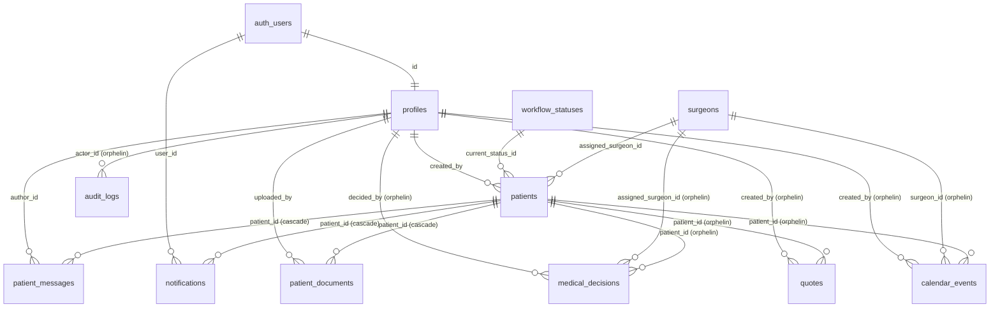

# 00 — Inventaire d'architecture (lecture seule)

**Périmètre :** Tracker Marcel — `franchir-patient-tracker` — Supabase `zdmeidekszdrzmjuasee` (prod).
**Date d'inspection :** 2026-09-14.
**Méthode :** aucune écriture. Sources croisées :

1. Dépôt : `supabase-schema.sql`, `supabase-rls-policies.sql`, `supabase/migrations/*`, `scripts/*.sql`, `lib/**`, `app/api/**`, Edge Function `sync-patient-to-questionnaires`.
2. Introspection live du projet prod via MCP Supabase (`list_tables`, `list_migrations`, `get_advisors`) et requêtes **SELECT uniquement** sur `pg_catalog` / `information_schema` + agrégats sans identité (voir `audit_queries/00_schema_inventory.sql`).

Aucune donnée nominative n'a été extraite ni reproduite ici (compteurs et taxonomies uniquement).

---

## 1. Cartographie système

| Composant | Rôle | Emplacement |
|---|---|---|
| Next.js (App Router) sur Vercel | UI cockpit + routes API (contrôle d'accès applicatif) | `app/`, `lib/` |
| Supabase Postgres 17 (`zdmeidekszdrzmjuasee`, us-east-1) | Données tracker, RLS, triggers | `public.*` |
| Supabase Auth | Comptes staff (7 profils) ; trigger `on_auth_user_created` → `profiles` | `auth.users` |
| Supabase Storage | Bucket privé `patient-documents` (DICOM + PDF), URLs signées | `storage.objects` |
| Supabase Realtime | Publication `supabase_realtime` : `notifications`, `patient_messages` | — |
| Edge Function `sync-patient-to-questionnaires` | Webhook DB (INSERT/UPDATE `patients`) → upsert vers app questionnaires | `supabase/functions/` |
| App questionnaires (`vsnjahkrsqxbvspwhaka`) | Anamneze, lien magique patient, portail chirurgien ; callback retour `session-status` | repo `Franchir_Questionnaires_Patients` |
| Resend | E-mails staff (nouveau dossier, statut, message, assignation chirurgien) | `lib/notifications.ts` |

**Clients Supabase côté serveur :**

- Client session (`createServerClient`) : RLS appliquée avec le JWT staff.
- Client **service-role** (`lib/supabase/service-role.ts`) : bypass RLS. Utilisé par : callback `session-status`, émission lien questionnaire, `markQuestionnaireLinkIssued`, reconcile, documents (`finalize`, `DELETE`), bridge health, et **toutes les écritures workflow de Gilles** (`getWriteClient` dans `change-status`).

---

## 2. Inventaire des tables (état prod live)

Compteurs exacts au 2026-09-14. Colonne « Usage » = croisement code applicatif ↔ données.

| Table | Lignes | RLS | Usage |
|---|---:|---|---|
| `profiles` | 7 | on | **Actif** — annuaire staff, rôle enum |
| `workflow_statuses` | 11 | on | **Actif** — référentiel statuts (drift repo, cf. §5) |
| `surgeons` | 6 | on | **Actif** — annuaire chirurgiens (assignation + sync questionnaires) |
| `patients` | 33 | on | **Actif** — entité pivot (dossier = patient, 1:1) |
| `patient_messages` | 272 | on | **Actif** — journal d'activité + messagerie (source d'événements) |
| `notifications` | 527 | on | **Actif** — cloche in-app (par utilisateur) |
| `patient_documents` | 5 159 | on | **Actif** — métadonnées fichiers Storage (DICOM/PDF) |
| `medical_decisions` | 0 | on | **Orphelin** — jamais écrit par le code |
| `quotes` | 0 | on | **Orphelin** — le devis vit sur `patients.quote_amount` |
| `calendar_events` | 0 | on | **Orphelin** — la date vit sur `patients.proposed_date` |
| `audit_logs` | 0 | on | **Orphelin** — aucune policy INSERT, jamais alimenté |

> Il n'existe **pas** de table « dossier », « tâche », « intervention » ou « devis » distincte en usage : le dossier **est** la ligne `patients` ; les tâches sont **dérivées** du statut par `lib/workflow-v2.ts` ; l'intervention se réduit à `proposed_date` + `date_accepted` ; le devis à `quote_amount` + `quote_accepted`.

### 2.1 `patients` (colonnes live)

| Colonne | Type | Null | Origine | Note |
|---|---|---|---|---|
| `id` | uuid PK | non | schéma initial | |
| `patient_name` | text | non | schéma initial | PHI |
| `clinical_summary` | text | oui | schéma initial | PHI clinique |
| `sharepoint_link` | text | oui | schéma initial | lien externe (accès docs) |
| `current_status_id` | uuid FK `workflow_statuses` | oui | schéma initial | statut workflow |
| `assigned_surgeon_id` | uuid FK `surgeons` | oui | schéma initial | responsable chirurgical |
| `created_by` | uuid FK `profiles` | non | schéma initial | auteur création |
| `created_at`, `updated_at` | timestamptz | oui | schéma initial | **`updated_at` non maintenu** (pas de trigger en prod, cf. §6) |
| `recommended_surgeons` | jsonb `'[]'` | oui | non versionné | **Orphelin** : aucune référence dans le code, 0 dossier renseigné |
| `quote_accepted`, `date_accepted` | bool `false` | oui | `20240126` | confirmations Marcel |
| `status` | text `'draft'` | oui | non versionné | **Legacy** : non lu par le code, valeur `'draft'` sur 33/33 |
| `quote_amount` | numeric | oui | `20240113` | budget indicatif (€) — 1 seule valeur écrasable |
| `proposed_date` | timestamptz | oui | `20240113` | date proposée (1 seule) |
| `patient_email` | text | oui | `20260613120000` | PHI, transmis au pont |
| `questionnaire_status` | text | oui | `20260613120000` | sous-état `sent` / `completed` / null |
| `questionnaire_completed_at` | timestamptz | oui | `20260613120000` | posé par callback |
| `questionnaire_summary` | text | oui | `20260613120000` | PHI clinique (résumé Anamneze) |
| `form_types` | text[] check | non | `20260614120000` | pathologie (`cervical`/`lombaire`) |
| `patient_phone` | text | oui | `20260617120000` | PHI |
| `questionnaire_language` | text check | non | `20260617120000` | `fr`/`en` |
| `questionnaire_sent_at` | timestamptz | oui | `20260717091050` | horloge stuck-sent (backfill depuis `updated_at`) |
| `last_questionnaire_url` | text | oui | migration prod `20260909 questionnaire_last_url_caching` **absente du repo** ; aucune référence dans le code tracker | **Secret** : lien magique patient en clair (1 dossier renseigné) |
| `last_questionnaire_url_expires_at` | timestamptz | oui | idem | |

### 2.2 `patient_messages` (journal d'activité)

| Colonne | Type | Note |
|---|---|---|
| `id` uuid PK ; `patient_id` uuid FK cascade NOT NULL | | |
| `author_id` FK `profiles` (nullable), `author_name`, `author_role` text | | dénormalisé ; 1 ligne sans `author_id` (script ops) |
| `kind` text NOT NULL default `'message'` | | valeurs observées : `message`, `status_change`, `action`, `system` — **pas de CHECK** |
| `title` text, `body` text NOT NULL | | texte libre ; les valeurs métier (montant, nom chirurgien, motif) y sont **noyées** |
| `topic` text default `'medical'` CHECK (`medical`,`commercial`,`system`,`audit`) | | DDL du `topic` non versionnée dans le repo |
| `meta` jsonb default `'{}'` | | clés observées : `action_id`, `old_status`, `new_status`, `source`, `form_types`, `questionnaire_language`, `email_sent`, `dispatch_mode`, `file_count`, `part_count`, … |
| `created_at` timestamptz | | seule horloge d'événement |

Pas de policy UPDATE/DELETE pour `authenticated` → append-only de facto (hors service-role).

### 2.3 `notifications`

`id`, `user_id` FK **`auth.users`** (pas `profiles`), `patient_id` FK cascade, `title`, `message` (contient le nom patient), `type` (`info`/`message`), `is_read` bool, `created_at`. Pas de `read_at`, pas de `link`.

### 2.4 `patient_documents`

Métadonnées fichiers : `kind` (`dicom`/`document`), `file_path` unique (`patients/{patientId}/…`), `file_name`, `mime_type`, `size_bytes`, `uploaded_by` FK `profiles`, `created_at`, + en-tête DICOM (`sop_instance_uid`, `series_instance_uid`, `series_description`, `body_part`, `instance_number`, `acquisition_datetime`). Index unique partiel `(patient_id, sop_instance_uid)`.

### 2.5 Référentiels

- `profiles` : `role` enum `user_role` = `marcel | franchir | gilles | admin` ; `email` unique.
- `surgeons` : `full_name`, `email`, `specialization`, `hospital`, `is_active`.
- `workflow_statuses` : `code` unique, `label`, `order_position`, `is_terminal`, `color`.

---

## 3. Relations (FK live)

Lecture métier :

| Concept demandé | Réalisation dans le schéma |
|---|---|
| Patient / Dossier | `patients` (fusionnés, 1 ligne = 1 dossier) |
| Utilisateurs | `profiles` (staff) ; `surgeons` (externes, sans compte tracker) |
| Tâches | **non persistées** — calculées par `getWorkflowHandoff` / `getAvailableActions` à partir de `current_status_id`, `quote_accepted`, `date_accepted`, `quote_amount`, `proposed_date` |
| Devis | `patients.quote_amount` + `quote_accepted` (table `quotes` vide) |
| Événements | `patient_messages` (activité) + `notifications` (diffusion) ; `audit_logs` vide |
| Interventions | `patients.proposed_date` + `date_accepted` + `assigned_surgeon_id` (table `calendar_events` vide) |

Suppression : `ON DELETE CASCADE` depuis `patients` vers messages, notifications, documents (table) — mais **pas** vers `storage.objects` (orphelins Storage possibles si suppression SQL directe).

---

## 4. Fonctions, triggers, publications, Storage

| Objet | Type | Détail |
|---|---|---|
| `handle_new_user()` | fn SECURITY DEFINER, trigger `on_auth_user_created` (auth.users) | crée/upsert `profiles` ; rôle depuis `raw_user_meta_data.role`, défaut `franchir` |
| `is_active_staff()` | fn SECURITY DEFINER STABLE | **Prod : contrôle rôle uniquement** (`role IN (marcel,franchir,gilles,admin)`) — le repo (`20260714193000`) prévoit aussi une whitelist e-mail |
| `notify_gilles_on_new_patient()` | fn SECURITY DEFINER, trigger AFTER INSERT `patients` | insère une notification par profil `gilles` (nom patient dans `message`) |
| `sync_patient_to_questionnaires` | trigger AFTER INSERT OR UPDATE `patients` → `supabase_functions.http_request` (timeout 5 s) | appelle l'Edge Function → pont questionnaires ; **tout UPDATE** de `patients` déclenche une sync |
| `rls_auto_enable()` | event trigger | force RLS sur toute nouvelle table `public` |
| `test_auth_uid()`, `test_set_auth_uid(uuid)` | fn SECURITY DEFINER | **artefacts de test** en prod (advisor : search_path mutable) |
| Publication `supabase_realtime` | | `public.notifications`, `public.patient_messages` |
| Bucket `patient-documents` | Storage | `public = false` ; policy `staff_full_access_patient_documents` (ALL, `is_active_staff()`) |

**Absent en prod alors que présent dans `supabase-schema.sql` :** trigger `update_patients_updated_at` / `update_profiles_updated_at`. Conséquence mesurée : `updated_at ≠ created_at` sur **3 / 33** dossiers seulement (les scripts ops qui posent `updated_at = NOW()` explicitement). `patients.updated_at` **n'est pas une horloge fiable** de dernière modification.

---

## 5. Référentiel `workflow_statuses` : prod vs repo vs code

| `code` (prod) | Label prod | ordre | terminal | Produit par le code ? | Mapping `GlobalStatus` (`lib/workflow-v2.ts`) |
|---|---|---:|---|---|---|
| `prospect_created` | Dossier créé | 1 | non | oui (création, `reopen_case`) | `draft` |
| `medical_review` | En revue médicale | 2 | non | oui | `medical_review` |
| `need_info` | À compléter | 3 | non | oui | `medical_more_info` |
| `validated_medical` | Validé médicalement | 4 | non | oui | `commercial_in_progress` |
| `quote_issued` | Devis envoyé | 5 | non | **non** | non mappé par code → fallback label « devis » → `commercial_in_progress` |
| `quote_accepted` | Devis accepté | 6 | non | **non** | idem |
| `surgery_scheduled` | Chirurgie programmée | 7 | non | oui | `scheduled` |
| `surgery_done` | Chirurgie effectuée | 8 | non | **non** | fallback label « chirurgie » → `commercial_in_progress` (incohérent) |
| `completed` | Dossier terminé | 9 | oui | **non** | fallback label « dossier » → `draft` (incohérent) |
| `case_closed` | Dossier fermé | 10 | oui | oui | `closed` |
| `rejected_medical` | Refusé médicalement | 99 | oui | oui | `rejected` |

- Le repo `supabase-schema.sql` seed **14 statuts** (`sent_to_surgeon`, `surgeon_*`, `quote_rejected`, `deposit_received`, `confirmed`…) : **absents en prod**. La prod correspond à `scripts/supabase-simplify-statuses.sql` (TRUNCATE + 10) + migration `case_closed`.
- 4 codes prod (`quote_issued`, `quote_accepted`, `surgery_done`, `completed`) sont **inatteignables** par l'application et **mal mappés** s'ils étaient posés à la main.
- Le statut réel est donc un espace à **7 codes effectifs**, projeté sur **7 `GlobalStatus`** (`draft`, `medical_review`, `medical_more_info`, `commercial_in_progress`, `scheduled`, `rejected`, `closed`).

Répartition prod (33 dossiers) : `validated_medical` 16 · `case_closed` 5 · `rejected_medical` 4 · `prospect_created` 4 · `medical_review` 3 · `need_info` 1 · `surgery_scheduled` 0.

---

## 6. Politiques RLS (état live, non modifiées)

Toutes les tables `public` ont RLS activée. Policies observées via `pg_policies` :

| Table | SELECT | INSERT | UPDATE | DELETE |
|---|---|---|---|---|
| `profiles` | authenticated : `true` | authenticated : `false` (trigger definer seul) | own (`auth.uid() = id`) | `false` |
| `patients` | authenticated : `true` | authenticated : **`true`** | authenticated : **`true`** | — (aucune → service-role seul) |
| `patient_messages` | authenticated : `true` **+** `public` : filtre topic Gilles (`medical`,`system`) | authenticated : `true` | — | — |
| `notifications` | own | `public` : `auth.role()='authenticated'` (`WITH CHECK`) | own | — |
| `patient_documents` | `is_active_staff()` | `is_active_staff()` | — | `is_active_staff()` |
| `medical_decisions`, `quotes`, `calendar_events` | `true` | `true` | `true` | — |
| `audit_logs` | `true` | — | — | — |
| `workflow_statuses`, `surgeons` | `true` | — | — | — |
| `storage.objects` (bucket `patient-documents`) | ALL : `bucket_id = 'patient-documents' AND is_active_staff()` | | | |

Constats (sans action) :

1. **Le cloisonnement par rôle n'est pas appliqué en base** sur `patients` / `patient_messages` : tout compte `authenticated` peut lire et écrire. Les règles métier (Gilles ne voit que certains statuts, seuls marcel/franchir/admin créent…) vivent **uniquement** dans les routes API (`lib/access-control.ts`, `patient-role-scope-guard.ts`, `canPerformWorkflowAction`). Un accès direct PostgREST avec un JWT staff contourne ces règles. Le fichier `supabase-rls-policies.sql` (policies par rôle) **n'est pas** l'état prod ; la prod reflète `supabase-fix-rls-performance.sql`.
2. La policy « Users can view messages for their patients » (filtre topic pour Gilles) est **inopérante** : elle est PERMISSIVE et coexiste avec « Authenticated users can view all messages » (`true`) → OR logique.
3. `is_active_staff()` prod ne vérifie **pas** la whitelist e-mail prévue par le repo ; la whitelist (`ACTIVE_STAFF_EMAILS`) n'est appliquée qu'en TypeScript.
4. `patient_messages` est publié en **Realtime** avec SELECT `true` : tout staff connecté reçoit tous les événements/messages, y compris `topic = 'commercial'` et `audit`.
5. Gilles écrit via **service-role** dans `change-status` (`getWriteClient`) : ses actions bypassent la RLS ; l'autorisation repose sur `canPerformWorkflowAction` + `denyRoleScopeForPatient`.
6. `audit_logs` n'a aucune voie d'écriture pour `authenticated` et n'est jamais alimentée par le code.

Advisors sécurité Supabase (WARN) : 4 fonctions SECURITY DEFINER exécutables par `anon` et `authenticated` via RPC (`handle_new_user`, `is_active_staff`, `notify_gilles_on_new_patient`, `rls_auto_enable`) ; `test_set_auth_uid` avec `search_path` mutable ; protection mots de passe compromis désactivée.

---

## 7. Champs sensibles (classification)

| Catégorie | Champs | Exposition |
|---|---|---|
| **Identifiants directs patient (PHI)** | `patients.patient_name`, `patient_email`, `patient_phone` ; `notifications.message` (nom patient inclus par templates + trigger) ; `patient_messages.body/title` (texte libre) | SELECT `true` pour tout staff ; Realtime sur `patient_messages` |
| **Données cliniques (PHI)** | `patients.clinical_summary`, `questionnaire_summary`, `form_types` (pathologie) ; `patient_documents.*` (métadonnées DICOM : `body_part`, `series_description`, `acquisition_datetime`, `file_name`) ; octets DICOM dans Storage (tags PatientName non anonymisés à la source) | table : `is_active_staff()` ; Storage : URLs signées courtes |
| **Secrets / capacités d'accès** | `patients.last_questionnaire_url` (lien magique = accès direct au questionnaire patient, en clair), `sharepoint_link` | lisibles par tout `authenticated` (policy SELECT `true`) |
| **Financier** | `patients.quote_amount`, `proposed_date`, `quote_accepted`, `date_accepted` | tout staff, y compris Gilles côté base (masqué seulement en UI) |
| **Identité staff / praticiens** | `profiles.email`, `full_name`, `role` ; `surgeons.email`, `full_name` ; whitelist e-mails en dur dans `lib/access-control.ts` et migration `20260714193000` | SELECT `true` |
| **Traçabilité** | `patient_messages.meta`, `author_*` ; `notifications.is_read` | append-only de facto (pas de policy UPDATE/DELETE) |

Transferts sortants : `patient_name`, `patient_email`, `patient_phone`, `clinical_summary`, `sharepoint_link`, `form_types`, `workflowStatus`, `surgeon email/name` partent vers l'app questionnaires à **chaque UPDATE** de `patients` (trigger). Nom patient dans les e-mails Resend staff et chirurgien.

---

## 8. Dérive repo ↔ prod (à consigner, pas à corriger ici)

| # | Sujet | Repo | Prod |
|---|---|---|---|
| 1 | Migrations enregistrées | 15 fichiers `supabase/migrations/` | 7 versions (`remote_schema` baseline 2026-05-03 + 6) ; la plupart des fichiers repo ont été appliqués hors historique |
| 2 | `is_active_staff()` | rôle + whitelist e-mail | rôle seul |
| 3 | RLS `patients`/`quotes`/… | policies par rôle (`supabase-rls-policies.sql`) | policies `true` (`supabase-fix-rls-performance.sql`) |
| 4 | `workflow_statuses` | seed 14 codes | 11 codes (10 simplifiés + `case_closed`) |
| 5 | Trigger `updated_at` | déclaré | absent |
| 6 | Colonnes `patients.status`, `recommended_surgeons`, `last_questionnaire_url(_expires_at)` | absentes du repo | présentes |
| 7 | `patient_messages.topic` + CHECK (`audit`) | non versionné (`scripts/supabase-create-messages-table.sql` sans `topic`) | présent |
| 8 | Trigger notification Gilles | `notify_doctor_on_new_patient` | `notify_gilles_on_new_patient` |
| 9 | `lib/types/database.ts` | ne connaît ni `quote_amount`, `proposed_date`, `quote_accepted`, `date_accepted`, `questionnaire_sent_at`, `topic`, `kind='action'` | — |
| 10 | Notifications « Action commerciale » | code présent | 0 ligne en prod (jamais déclenché ou trop récent) |

---

## 9. Écritures et leur traçabilité (vue d'ensemble)

| Chemin d'écriture | Client | Tables touchées | Événement `patient_messages` ? |
|---|---|---|---|
| `POST /api/patients` (création) | session | `patients`, `notifications` (+ trigger Gilles, + trigger sync) | oui, `system` / `create_patient` (**depuis 2026-09-11 seulement** : 1 / 33 dossiers) |
| `POST /api/patients/[id]/change-status` (12 `ActionId`) | session (Gilles : service-role) | `patients` (statut, surgeon, quote/date flags, montant, date), `notifications` | oui (`status_change` ou `action`, `meta.action_id`) |
| `PATCH /api/patients/[id]/commercial-data` | session | `patients.quote_amount`, `proposed_date` | **non** |
| `PATCH /api/patients/[id]/update-summary` | session | `patients.clinical_summary`, `sharepoint_link` | **non** |
| `POST /api/patients/[id]/messages` | session | `patient_messages` (`kind=message`) | c'est l'événement ; **`topic` envoyé par l'UI ignoré → toujours `medical`** |
| `POST …/questionnaire-link` | service-role | `patients.form_types`, `questionnaire_language` | oui (`audit` : `questionnaire_prepare` / `_new_session` / `_resend`) |
| `POST …/questionnaire-dispatch-confirm` | service-role | `questionnaire_status=sent`, `questionnaire_sent_at` | oui (`questionnaire_staff_dispatch`) |
| `POST …/questionnaire-revoke` | pont M2M | (côté questionnaires) | **non** |
| `POST /api/integrations/questionnaires/session-status` (callback) | service-role | `questionnaire_status=completed`, `_completed_at`, `_summary` | **non** |
| `reconcileQuestionnaire*` (dashboard) | service-role | `questionnaire_status`, `_sent_at`, `_completed_at`, `_summary` | **non** |
| `POST …/documents/finalize`, `DELETE …/documents/[docId]` | service-role | `patient_documents`, Storage | **non** (upload : `created_at` de la ligne ; suppression : aucune trace) |
| Exports imagerie | session | — | oui (`audit` : `dicom_study_export_*`) |
| `PATCH /api/notifications` | session | `notifications.is_read` | non (pas de `read_at`) |
| Scripts SQL ops (`supabase/scripts/`) | SQL Editor | `patients`, `patient_messages` | partiel (1 script journalise avec `meta.source='ops_sql'`, l'autre non) |

---

## 10. Points d'attention pour la suite de l'audit

1. Le **journal d'événements** utile est `patient_messages` ; `audit_logs` est vide et ne doit pas être considéré comme source.
2. Les valeurs métier des actions (montant, dates proposées, nom du chirurgien, motif) ne sont **pas structurées** dans `meta` : elles sont dans `body` (texte). Toute reconstruction quantitative devra parser ou s'appuyer sur l'état courant de `patients`.
3. `patients.updated_at` est inutilisable comme horloge ; `questionnaire_sent_at` a été backfillé à partir de `updated_at`/`created_at` (imprécis pour les dossiers antérieurs au 2026-07-17).
4. Le cloisonnement Gilles / commercial est **UI + API only** ; la base et le Realtime exposent tout.
5. `last_questionnaire_url` stocke un secret patient en clair lisible par tout staff.
6. Quatre codes statut en base sont hors modèle applicatif ; deux d'entre eux seraient mal projetés (`surgery_done` → commercial, `completed` → brouillon).
